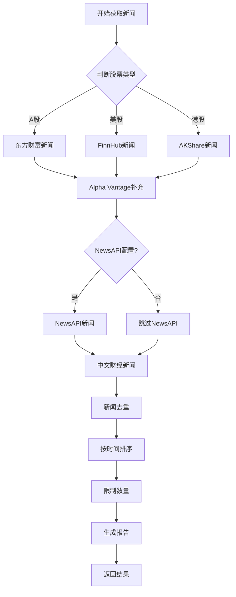

# 📰 新闻源配置说明文档

## 📋 目录

- [概述](#概述)
- [新闻源分类](#新闻源分类)
- [详细配置](#详细配置)
- [使用状态](#使用状态)
- [API密钥配置](#api密钥配置)
- [测试文件说明](#测试文件说明)
- [常见问题](#常见问题)

---

## 概述

本项目支持多种新闻数据源,包括**中文财经新闻**和**英文全球新闻**。新闻源按照优先级和可用性进行聚合,确保获取最新、最相关的股票新闻。

### 核心特性

- ✅ **多源聚合** - 从多个新闻源获取数据并去重
- ✅ **智能分类** - 按紧急程度(高/中/低)自动分类
- ✅ **时效性保证** - 优先获取最新新闻(默认6小时内)
- ✅ **相关性评分** - 自动计算新闻与股票的相关性
- ✅ **自动去重** - 智能去除重复新闻

---

## 新闻源分类

### 🇨🇳 中文新闻源(A股/港股)

| 新闻源 | 状态 | 免费 | API密钥 | 支持市场 | 优先级 |
|--------|------|------|---------|----------|--------|
| **东方财富** (AKShare) | ✅ 可用 | ✅ 免费 | ❌ 不需要 | A股、港股 | ⭐⭐⭐ 最高 |
| **财联社 RSS** | ✅ 可用 | ✅ 免费 | ❌ 不需要 | 全市场 | ⭐⭐⭐ 高 |

### 🌍 英文新闻源(美股/全球)

| 新闻源 | 状态 | 免费 | API密钥 | 支持市场 | 优先级 |
|--------|------|------|---------|----------|--------|
| **FinnHub** | ✅ 可用 | ✅ 有免费版 | ✅ 需要 | 美股 | ⭐⭐⭐ 最高 |
| **Alpha Vantage** | ✅ 可用 | ✅ 有免费版 | ✅ 需要 | 美股 | ⭐⭐⭐ 高 |
| **NewsAPI** | ⚠️ 可选 | ✅ 有免费版 | ✅ 需要 | 全球 | ⭐⭐ 中等 |
| **Google News** | ✅ 可用 | ✅ 免费 | ❌ 不需要 | 全球 | ⭐⭐ 中等 |

### 📊 其他数据源

| 数据源 | 用途 | 状态 |
|--------|------|------|
| **MongoDB缓存** | 本地缓存,最快速度 | ✅ 可用 |
| **本地文件** | 离线数据 | ✅ 可用 |

---

## 详细配置

### 1. 东方财富新闻 (AKShare) ⭐⭐⭐

**推荐用于**: A股、港股

**特点**:
- ✅ 完全免费,无需API密钥
- ✅ 数据质量高,更新及时
- ✅ 支持个股新闻查询
- ✅ 中文内容,适合中国市场

**配置方法**:
```python
from tradingagents.dataflows.providers.china.akshare import AKShareProvider

provider = AKShareProvider()
news_df = provider.get_stock_news_sync(symbol="000001", limit=10)
```

**数据字段**:
- `新闻标题` - 新闻标题
- `新闻内容` - 新闻内容摘要
- `发布时间` - 发布时间
- `新闻链接` - 原文链接

**限制**:
- 仅支持A股和港股
- 依赖AKShare库的稳定性

---

### 2. FinnHub ⭐⭐⭐

**推荐用于**: 美股实时新闻

**特点**:
- ✅ 实时性强,数据更新快
- ✅ 免费版每分钟60次请求
- ✅ 提供新闻情感分析
- ✅ 支持历史新闻查询

**配置方法**:

1. **获取API密钥**:
   - 访问 [https://finnhub.io](https://finnhub.io)
   - 注册账号
   - 获取免费API密钥

2. **配置环境变量**:
   ```bash
   # .env 文件
   FINNHUB_API_KEY=your_api_key_here
   ```

3. **使用示例**:
   ```python
   import os
   os.environ['FINNHUB_API_KEY'] = 'your_key'
   
   from tradingagents.dataflows.news.realtime_news import RealtimeNewsAggregator
   
   aggregator = RealtimeNewsAggregator()
   news = aggregator.get_realtime_stock_news('AAPL', hours_back=6)
   ```

**API限制**:
- 免费版: 60次/分钟
- 付费版: 更高频率

---

### 3. Alpha Vantage ⭐⭐⭐

**推荐用于**: 美股新闻和情感分析

**特点**:
- ✅ 提供新闻情感评分
- ✅ 免费版每天500次请求
- ✅ 数据质量高
- ✅ 支持多个ticker查询

**配置方法**:

1. **获取API密钥**:
   - 访问 [https://www.alphavantage.co](https://www.alphavantage.co)
   - 免费注册
   - 获取API密钥

2. **配置环境变量**:
   ```bash
   # .env 文件
   ALPHA_VANTAGE_API_KEY=your_api_key_here
   ```

3. **使用示例**:
   ```python
   import os
   os.environ['ALPHA_VANTAGE_API_KEY'] = 'your_key'
   
   from tradingagents.dataflows.news.realtime_news import RealtimeNewsAggregator
   
   aggregator = RealtimeNewsAggregator()
   news = aggregator.get_realtime_stock_news('TSLA', hours_back=6)
   ```

**API限制**:
- 免费版: 500次/天
- 每次最多返回50条新闻

---

### 4. NewsAPI ⚠️

**推荐用于**: 全球新闻搜索(可选)

**特点**:
- ✅ 覆盖全球新闻源
- ✅ 支持关键词搜索
- ⚠️ 免费版有延迟(24小时)
- ⚠️ 免费版有请求限制

**配置方法**:

1. **获取API密钥**:
   - 访问 [https://newsapi.org](https://newsapi.org)
   - 注册账号
   - 获取免费API密钥

2. **配置环境变量**:
   ```bash
   # .env 文件
   NEWSAPI_KEY=your_api_key_here
   ```

**API限制**:
- 免费版: 100次/天
- 免费版新闻延迟24小时
- 付费版: 实时新闻

**注意**: 由于免费版有24小时延迟,**不推荐用于实时交易决策**。

---

### 5. Google News ⭐⭐

**推荐用于**: 全球新闻补充

**特点**:
- ✅ 完全免费
- ✅ 无需API密钥
- ✅ 覆盖全球新闻
- ✅ 支持RSS订阅

**配置方法**:

1. **使用Python GNews库**:
   ```bash
   pip install gnews
   ```

2. **使用示例**:
   ```python
   from gnews import GNews
   
   google_news = GNews(language='en', country='US', max_results=10)
   news = google_news.get_top_news()
   
   # 搜索特定股票
   stock_news = google_news.get_news('AAPL stock')
   ```

3. **使用RSS Feed**:
   ```bash
   # 美国新闻
   curl -sL "https://news.google.com/rss?hl=en-US&gl=US&ceid=US:en"
   
   # 香港新闻
   curl -sL "https://news.google.com/rss?hl=zh-HK&gl=HK&ceid=HK:zh-Hant"
   ```

**限制**:
- 可能受到IP限制
- 需要良好的网络环境
- 建议使用VPS部署

**VPS测试**: 已创建完整的测试脚本,详见 `google_news_scripts/` 文件夹。

---

### 6. 财联社 RSS ⚠️

**推荐用于**: 中文财经快讯

**特点**:
- ✅ 免费
- ✅ 实时性强
- ⚠️ 需要解析RSS
- ⚠️ 可能需要代理

**配置方法**:
```python
import feedparser

rss_url = "https://www.cls.cn/api/sw?app=CailianpressWeb&os=web&sv=7.7.5"
feed = feedparser.parse(rss_url)

for entry in feed.entries:
    print(entry.title)
    print(entry.published)
```

**依赖**:
```bash
pip install feedparser
```

---

## 使用状态

### ✅ 已启用的新闻源

1. **东方财富** (AKShare)
   - 用于: A股个股新闻
   - 状态: ✅ 正常使用
   - 优先级: 最高

2. **FinnHub**
   - 用于: 美股实时新闻
   - 状态: ✅ 正常使用(需配置API密钥)
   - 优先级: 最高

3. **Alpha Vantage**
   - 用于: 美股新闻和情感分析
   - 状态: ✅ 正常使用(需配置API密钥)
   - 优先级: 高

### ⚠️ 可选的新闻源

1. **NewsAPI**
   - 状态: ⚠️ 可选(免费版有延迟)
   - 建议: 仅用于非实时场景

2. **财联社 RSS**
   - 状态: ⚠️ 部分可用
   - 建议: 需要测试稳定性

3. **Google News**
   - 状态: ✅ 可用(需VPS)
   - 建议: 作为补充新闻源

---

## API密钥配置

### 配置文件位置

```
TradingAgents-arm32/
├── .env                    # 主配置文件(本地开发)
├── .env.example            # 配置模板
└── .env.docker             # Docker配置
```

### 配置示例

在 `.env` 文件中添加:

```bash
# FinnHub API密钥
FINNHUB_API_KEY=your_finnhub_api_key_here

# Alpha Vantage API密钥
ALPHA_VANTAGE_API_KEY=your_alpha_vantage_api_key_here

# NewsAPI密钥(可选)
NEWSAPI_KEY=your_newsapi_key_here
```

### 获取API密钥

| 服务 | 注册链接 | 免费额度 |
|------|----------|----------|
| FinnHub | [finnhub.io](https://finnhub.io) | 60次/分钟 |
| Alpha Vantage | [alphavantage.co](https://www.alphavantage.co) | 500次/天 |
| NewsAPI | [newsapi.org](https://newsapi.org) | 100次/天 |

---

## 测试文件说明

### 新闻源测试文件

| 文件 | 用途 | 位置 |
|------|------|------|
| `test_finnhub_news.py` | 测试FinnHub新闻API | 项目根目录 |
| `test_alpha_vantage_news.py` | 测试Alpha Vantage新闻 | 项目根目录 |
| `test_google_news_connection.py` | 测试Google News连接 | 项目根目录 |
| `test_akshare_news_direct.py` | 测试AKShare新闻接口 | 项目根目录 |
| `test_hk_news.py` | 测试港股新闻获取 | 项目根目录 |

### Google News测试脚本

完整的Google News测试工具集位于 `google_news_scripts/` 文件夹:

```
google_news_scripts/
├── START_HERE.md           # 快速入门
├── 使用说明.md             # 中文详细说明
├── test/                   # 测试脚本
│   ├── test_complete.sh    # 完整测试
│   ├── test_with_dns_fix.sh # DNS修复
│   └── test_python.py      # Python测试
└── tools/                  # 实用工具
    ├── get_news.sh         # 一键获取新闻
    └── simple_news.py      # Python工具
```

**使用方法**:
```bash
cd google_news_scripts
bash tools/get_news.sh
```

---

## 常见问题

### Q1: 如何选择合适的新闻源?

**A**: 根据股票市场选择:
- **A股**: 优先使用东方财富(AKShare)
- **美股**: 使用FinnHub + Alpha Vantage
- **港股**: 使用AKShare或Google News
- **全球**: 使用Google News

### Q2: API密钥如何获取?

**A**: 
1. 访问对应服务的官网
2. 免费注册账号
3. 在账户设置中获取API密钥
4. 添加到 `.env` 文件

### Q3: 免费API有什么限制?

**A**: 
- **FinnHub**: 60次/分钟
- **Alpha Vantage**: 500次/天
- **NewsAPI**: 100次/天,延迟24小时
- **AKShare**: 无限制,但依赖网络稳定性

### Q4: 新闻获取失败怎么办?

**A**: 
1. 检查API密钥是否正确配置
2. 检查网络连接
3. 查看日志中的错误信息
4. 尝试使用备用新闻源

### Q5: 如何提高新闻获取速度?

**A**: 
1. 使用MongoDB缓存
2. 减少 `hours_back` 参数
3. 限制 `max_news` 数量
4. 使用多线程并发获取

### Q6: Google News在VPS上无法访问?

**A**: 
1. 检查DNS配置: `bash google_news_scripts/test/test_with_dns_fix.sh`
2. 使用Google DNS (8.8.8.8)
3. 确保VPS在非限制地区
4. 查看完整测试脚本: `google_news_scripts/使用说明.md`

### Q7: 如何添加新的新闻源?

**A**: 
1. 在 `tradingagents/constants/data_sources.py` 中注册
2. 在 `tradingagents/dataflows/news/realtime_news.py` 中实现
3. 创建测试文件验证
4. 更新本文档

---

## 新闻聚合流程



---

## 代码示例

### 获取A股新闻

```python
from tradingagents.dataflows.news.realtime_news import get_realtime_stock_news

# 获取平安银行(000001)的新闻
news_report = get_realtime_stock_news(
    ticker="000001.SZ",
    curr_date="2025-12-09",
    hours_back=6
)

print(news_report)
```

### 获取美股新闻

```python
from tradingagents.dataflows.news.realtime_news import RealtimeNewsAggregator

aggregator = RealtimeNewsAggregator()

# 获取苹果公司新闻
news_items = aggregator.get_realtime_stock_news(
    ticker="AAPL",
    hours_back=6,
    max_news=10
)

# 生成报告
report = aggregator.format_news_report(news_items, "AAPL")
print(report)
```

### 使用Google News

```python
from gnews import GNews

# 创建实例
google_news = GNews(language='en', country='US', max_results=10)

# 获取头条
top_news = google_news.get_top_news()

# 搜索特定股票
stock_news = google_news.get_news('Tesla stock')

for news in stock_news:
    print(f"{news['title']}")
    print(f"  发布者: {news['publisher']['title']}")
    print(f"  时间: {news['published date']}")
    print()
```

---

## 性能优化建议

1. **使用缓存**
   - 启用MongoDB缓存
   - 设置合理的缓存过期时间

2. **并发获取**
   - 使用异步IO
   - 多线程并发请求

3. **限制请求**
   - 设置合理的 `hours_back`
   - 限制 `max_news` 数量

4. **错误处理**
   - 实现重试机制
   - 使用备用新闻源

---

## 更新日志

- **2025-12-09**: 创建新闻源配置文档
- **2025-12-09**: 添加Google News测试脚本集
- **2025-12-08**: 修复AKShare新闻接口问题

---

**文档维护**: 请在添加或修改新闻源时及时更新本文档。

**相关文档**:
- [数据源配置](tradingagents/constants/data_sources.py)
- [实时新闻聚合器](tradingagents/dataflows/news/realtime_news.py)
- [Google News测试工具](google_news_scripts/使用说明.md)
