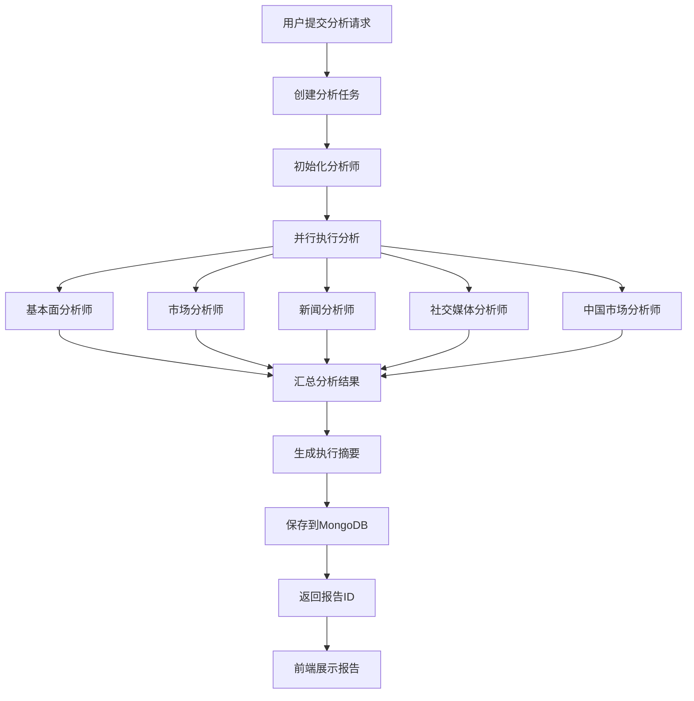

# 📊 TradingAgents 项目前端报告呈现分析

> 分析时间: 2025-12-09  
> 目的: 了解项目最终在前端呈现哪些报告给用户

---

## 🎯 核心报告类型

### 单股分析报告 (主要)

这是项目的核心产品,为用户提供**单只股票的综合投资分析报告**。

---

## 📋 报告结构

### 1. 报告元数据

| 字段 | 说明 | 示例 |
|------|------|------|
| `analysis_id` | 分析报告唯一ID | `AAPL_20251209_abc123` |
| `stock_symbol` | 股票代码 | `000001.SZ` |
| `stock_name` | 股票名称 | `平安银行` |
| `market_type` | 市场类型 | `A股` / `港股` / `美股` |
| `analysis_date` | 分析日期 | `2025-12-09` |
| `created_at` | 创建时间 | `2025-12-09T14:30:00+08:00` |
| `status` | 报告状态 | `completed` / `pending` / `failed` |

### 2. 分析配置

| 字段 | 说明 | 示例 |
|------|------|------|
| `analysts` | 参与的分析师 | `["market", "fundamentals", "news", "social"]` |
| `research_depth` | 研究深度 | `1` (快速) / `2` (标准) / `3` (深度) |
| `model_info` | 使用的AI模型 | `gemini-2.0-flash-exp` |

### 3. 核心分析报告 (`reports` 对象)

这是报告的核心内容,包含多个分析模块:

#### 3.1 基本面分析 (`fundamentals_analyst`)

**内容**:
- 📊 财务数据分析
  - 营收、利润、现金流
  - 资产负债表分析
  - 财务比率 (PE, PB, ROE等)
- 📈 盈利能力评估
- 💰 估值分析
- 🏢 公司基本信息

**数据来源**:
- TuShare / AKShare / BaoStock
- 财务报表数据
- 实时行情数据

#### 3.2 市场分析 (`market_analyst`)

**内容**:
- 📉 技术指标分析
  - MA (移动平均线)
  - MACD
  - RSI
  - 布林带
- 📊 成交量分析
- 📈 价格趋势分析
- 🎯 支撑位/阻力位

**数据来源**:
- 历史行情数据
- 技术指标计算

#### 3.3 新闻分析 (`news_analyst`)

**内容**:
- 📰 最新新闻汇总
- 🔍 新闻情感分析
- ⚡ 重要事件识别
- 📊 新闻影响评估

**数据来源** (已集成的8个新闻源):
1. FinnHub (美股)
2. Alpha Vantage (全球)
3. 财联社 RSS (中国)
4. Yahoo Finance (港股)
5. 金十数据 (全球)
6. 华尔街见闻 (全球)
7. 格隆汇 (港股)
8. 财联社电报 (A股)

#### 3.4 社交媒体分析 (`social_media_analyst`)

**内容**:
- 💬 社交媒体情绪
- 📊 讨论热度分析
- 🎯 关键话题识别
- 👥 投资者情绪

**数据来源**:
- 雪球
- 东方财富股吧
- Twitter/X (美股)

#### 3.5 中国市场分析 (`china_market_analyst`)

**内容** (仅A股):
- 🇨🇳 A股特有指标
- 📊 行业对比
- 🏛️ 政策影响分析
- 💹 市场情绪

---

## 📊 报告输出格式

### 主要格式

1. **Markdown** (默认)
   - 结构化文本
   - 易于阅读
   - 支持在线预览

2. **JSON**
   - 完整数据结构
   - 便于程序处理
   - 包含所有元数据

3. **Word (DOCX)**
   - 专业文档格式
   - 可编辑
   - 需要 pandoc

4. **PDF**
   - 打印友好
   - 不可编辑
   - 需要 pandoc + PDF引擎

---

## 🎨 前端呈现方式

### 1. 报告列表页

**显示内容**:
- 报告标题 (股票名称 + 代码)
- 市场类型标签
- 创建时间
- 分析状态
- 快速操作 (查看/下载/删除)

**功能**:
- 🔍 搜索 (股票代码/名称)
- 🏷️ 筛选 (市场类型/日期范围)
- 📄 分页显示
- 📊 排序 (时间/股票代码)

### 2. 报告详情页

**布局结构**:

```
┌─────────────────────────────────────────┐
│  报告头部                                │
│  - 股票名称 (代码)                       │
│  - 市场类型 | 分析日期 | 模型信息        │
│  - 下载按钮 (MD/JSON/DOCX/PDF)          │
└─────────────────────────────────────────┘

┌─────────────────────────────────────────┐
│  执行摘要                                │
│  - 投资建议 (买入/持有/卖出)             │
│  - 置信度评分                            │
│  - 风险等级                              │
│  - 关键要点                              │
└─────────────────────────────────────────┘

┌─────────────────────────────────────────┐
│  分析模块 (Tab 切换)                     │
│  ├─ 📊 基本面分析                        │
│  ├─ 📈 市场分析                          │
│  ├─ 📰 新闻分析                          │
│  ├─ 💬 社交媒体分析                      │
│  └─ 🇨🇳 中国市场分析 (仅A股)            │
└─────────────────────────────────────────┘

┌─────────────────────────────────────────┐
│  报告元数据                              │
│  - 执行时间                              │
│  - Token使用量                           │
│  - 参与分析师                            │
└─────────────────────────────────────────┘
```

### 3. 报告内容渲染

**Markdown 渲染**:
- 标题层级
- 表格展示
- 列表项
- 代码块
- 引用块

**数据可视化** (可选增强):
- 📊 财务数据图表
- 📈 股价走势图
- 📉 技术指标图
- 🎯 情感分析图

---

## 📈 报告生成流程



---

## 💾 数据存储

### MongoDB 集合

**1. `analysis_reports`** (主要)
- 存储完整的分析报告
- 包含所有分析模块内容
- 支持快速查询和检索

**2. `analysis_tasks`** (任务记录)
- 存储分析任务状态
- 记录执行过程
- 备份报告数据

### 数据结构示例

```json
{
  "_id": "ObjectId(...)",
  "analysis_id": "000001_20251209_abc123",
  "stock_symbol": "000001.SZ",
  "stock_name": "平安银行",
  "market_type": "A股",
  "analysis_date": "2025-12-09",
  "status": "completed",
  "created_at": "2025-12-09T14:30:00Z",
  "updated_at": "2025-12-09T14:35:00Z",
  
  "analysts": ["market", "fundamentals", "news", "social"],
  "research_depth": 2,
  "model_info": "gemini-2.0-flash-exp",
  
  "summary": "执行摘要内容...",
  "recommendation": "买入",
  "confidence_score": 0.85,
  "risk_level": "中等",
  "key_points": ["要点1", "要点2", "要点3"],
  
  "reports": {
    "fundamentals_analyst": "# 基本面分析\n\n...",
    "market_analyst": "# 市场分析\n\n...",
    "news_analyst": "# 新闻分析\n\n...",
    "social_media_analyst": "# 社交媒体分析\n\n...",
    "china_market_analyst": "# 中国市场分析\n\n..."
  },
  
  "execution_time": 120.5,
  "tokens_used": 15000
}
```

---

## 🎯 用户价值

### 1. 综合性分析

用户获得**一站式**的股票投资分析报告,包含:
- 财务数据
- 技术指标
- 新闻情感
- 社交情绪
- 市场趋势

### 2. AI驱动洞察

- 🤖 AI分析师提供专业见解
- 📊 数据驱动的投资建议
- ⚡ 实时新闻和情绪分析

### 3. 多格式导出

- 在线查看 (Markdown)
- 数据分析 (JSON)
- 专业报告 (Word/PDF)

### 4. 历史记录

- 📚 保存所有分析报告
- 📊 对比历史分析
- 📈 追踪投资决策

---

## 🔄 报告更新机制

### 实时性

- 新闻数据: **实时** (15分钟缓存)
- 行情数据: **实时** (分钟级)
- 财务数据: **季度更新**
- 社交情绪: **实时**

### 重新分析

用户可以:
- 🔄 重新生成报告 (获取最新数据)
- 📊 调整研究深度
- 🎯 选择不同分析师组合

---

## 📱 前端技术栈 (推测)

基于代码分析,前端可能使用:

- **框架**: React / Vue
- **UI库**: Ant Design / Element UI
- **Markdown渲染**: react-markdown / marked
- **图表**: ECharts / Chart.js
- **状态管理**: Redux / Vuex
- **HTTP客户端**: Axios

---

## 🎨 UI/UX 特点

### 1. 清晰的信息层级

- 标题 → 摘要 → 详细分析
- 重要信息突出显示
- 模块化内容组织

### 2. 交互式体验

- Tab 切换不同分析模块
- 展开/折叠详细内容
- 快速导航锚点

### 3. 响应式设计

- 桌面端完整展示
- 移动端优化布局
- 平板端适配

---

## 📊 报告示例结构

### 执行摘要

```markdown
# 平安银行(000001.SZ) 投资分析报告

**分析日期**: 2025-12-09  
**市场类型**: A股  
**分析模型**: gemini-2.0-flash-exp

## 投资建议

**推荐**: 买入  
**置信度**: 85%  
**风险等级**: 中等

## 关键要点

1. 📈 基本面稳健,ROE持续提升
2. 📰 近期新闻偏正面,政策支持明显
3. 💬 社交媒体情绪积极
4. ⚠️ 短期技术指标显示超买
5. 🎯 建议分批建仓,控制仓位
```

### 基本面分析

```markdown
# 基本面分析

## 财务概况

| 指标 | 数值 | 同比 |
|------|------|------|
| 营业收入 | 1,234亿 | +12.5% |
| 净利润 | 345亿 | +15.3% |
| ROE | 15.2% | +1.2pp |
| PE | 8.5 | - |
| PB | 1.2 | - |

## 盈利能力

公司盈利能力持续提升...

## 估值分析

当前估值处于历史低位...
```

---

## 🎯 总结

### 项目核心产出

**单股综合投资分析报告**,包含:

1. ✅ **5个分析模块**
   - 基本面分析
   - 市场分析
   - 新闻分析
   - 社交媒体分析
   - 中国市场分析 (A股)

2. ✅ **8个新闻数据源**
   - 覆盖全球主要市场
   - 实时财经快讯
   - 15分钟缓存保护

3. ✅ **4种导出格式**
   - Markdown (在线查看)
   - JSON (数据分析)
   - Word (专业报告)
   - PDF (打印分享)

4. ✅ **AI驱动分析**
   - 多个AI分析师协作
   - 数据驱动的投资建议
   - 可配置的研究深度

### 用户体验

- 📊 **一站式分析**: 无需切换多个平台
- ⚡ **实时数据**: 新闻和行情实时更新
- 🤖 **AI洞察**: 专业的投资建议
- 📱 **多端访问**: Web/移动端支持
- 💾 **历史记录**: 追踪投资决策

---

**分析日期**: 2025-12-09  
**状态**: ✅ 完成
